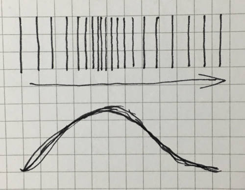
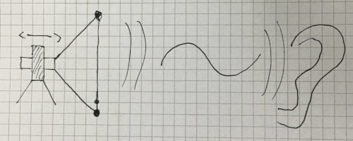

class: center, middle, title

# The musical Ruby
## A presentation for Euruko 2019

## Jan 'half/byte' Krutisch
## @halfbyte

---
class: center, middle, depfu, contain
background-image: url(images/depfu-left-blue.png)
---
class: contain
background-image: url(images/depfu_example.png)

---
class: center, middle, subtitle
# A warning
---
### Don't try to understand the code examples!

Note: This not meant as an insult. I'm just aware that it's a lot of code on very different subjects and it will be next to impossible to understand it during the presentation. Instead, go to [halfbyte/ruby_for_artists](https://github.com/ruby_for_artists) and study the examples there.

I'm providing the code fragments here to give you a sense of how much (or rather: how little) code is necessary and how the code looks in general. More of a teaser or taste bite than actually explaining how a library works.

The reason I have (in contrast to what every one tells you to do) a looong text on one slide is that I want to warn people who click through these slides later on.

(If you're sitting in the audience and you made it this far, please clap your hands twice.)
---
class: center, middle, subtitle
# Music
---
class: center, middle
# Let's start high level

---
class: center, middle
# SonicPi

## by Sam Aaron
---
class: center, middle
# Let's dig deeper

---
class: center, middle
# Pure Ruby

---
```ruby
SAMPLING_FREQUENCY=44100
FREQUENCY=440

in_cycle = 0
samples = SAMPLING_FREQUENCY.times.map do
  period = SAMPLING_FREQUENCY / FREQUENCY.to_f
  output = in_cycle > 0.5 ? -1.0 : 1.0
  in_cycle = (in_cycle + (1.0 / period)) % 1.0
  output *= 0.5
end
print samples.pack('e*')

```

---

# How to play?

---

# SoX to the rescue

---
# Lance Norskog
# Chris Bagwell
# (and many others)

(It started in 1991. yeah.)

---

```bash
#!/bin/bash
# play.sh
ruby $1 | play -t raw -b 32 -r 44100 -c 1 \
  -e floating-point --endian little -
```
---

<audio src="samples/square.wav" data-player="simple">

---
class: center, middle
# But how does it work?

---
class: center, middle

# Like, how does it really work.

---
class: center, middle

# What is sound

---
class: center, middle

# Pushing air particles



---
class: center, middle

# A tone


---
class: center, middle

# the full system


---
class: center, middle

# Electrical current > Air movement
TODO: Loudspeaker image

---
class: center, middle

# Digital Data > Electrical current
TODO: Image of a DAC chip
---
class: center, middle
# Digital to Analog Converter (DAC)


---
class: center, middle

# Two problems

1. Sampling Frequency
2. Sample Resolution

---
class: center, middle

# Sampling frequency vs. expressable frequencies


---
class: center, middle

# Nyquist - Shannon


<math>
  <mrow>
    <msub><mi>F</mi> <mi>max</mi></msub> = <mfrac><msub><mi>F</mi><mi>sample</mi></mi></msub>2</mfrac>
  </mrow>
</math>

---
class: center, middle
# So why 44,1 kHz?

---
class: middle

- Human hearing range
  - F<sub>max</sub> ~ 20000 Hz
  - F<sub>sample</sub> ~ 40000 Hz
- Reasons.

---
class: center, middle

# Sample Resolution

---
class: center, middle

# 8 Bit / 16 Bit / 24 Bit

---
class: center, middle
# Float vs. Int


---
class: middle, center
# Better is not always better
## (Quality vs. Storage space)
---
class: middle, center
# But sometimes it is
## (Overhead when editing/processing)
---
class: center, middle, subtitle
# A Ruby Synth

---
```ruby
SAMPLING_FREQUENCY=44100
FREQUENCY=440

in_cycle = 0
samples = SAMPLING_FREQUENCY.times.map do
  period = SAMPLING_FREQUENCY / FREQUENCY.to_f
  output = in_cycle > 0.5 ? -1.0 : 1.0
  in_cycle = (in_cycle + (1.0 / period)) % 1.0
  output *= 0.5
end
print samples.pack('e*')
```

---
class: center, middle
# A squarewave at 440 Hz

<audio src="samples/square.wav" data-player="scope">

---
class: center, middle
# A squarewave at 440 Hz

<audio src="samples/square.wav" data-player="fft">
---
class: center, middle
# Why 440 Hz?

---

class: center, middle
# 440 Hz = Concert Pitch
# A above middle C

---
class: center, middle
# Should it be 432 Hz?
---
class: center, middle
# Western notation
---
class: center, middle
# 1 Octave up = Double Frequency
# 1 Octave down = Half Frequency
---
class: center, middle
# 1 Octave = 12 Halftones
# C, C#, D, D#, E, F,
# F#, G, G#, A, A#, B
---
class: center, middle
# 1 Octave = 12 Halftones
# C, D♭, D, E♭, E, F,
# G♭, G, A♭, A, B♭, B
---
class: center, middle
# Tuning / Temperament
## (in short: it's complicated)
---
class: center, middle
# There's a standard for that
# (MIDI)
---

class: center, middle
<math>
  <mrow>
    <msup><mn>2</mn><mfrac><mrow><mi>n</mi><mo>-</mo><mn>69</mn></mrow><mn>12</mn></mfrac></msup><mo>*</mo><mn>440</mn><mu>Hz</mu>
  </mrow>
</math>
---
class: center, middle
# n = MIDI note (0-127)
# 0 = very low C
# 60 = middle C
---
class: center, middle
# A squarewave at 440 Hz

<audio src="samples/square.wav" data-player="fft">
---
class: center, middle
# Yes I know it sounds horrible
---
class: center, middle, subtitle
# Sculpting a sound
---
class: center, middle
# Subtractive Synthesis

---
class: center, middle
1. Start with high harmonic content
2. Filter down

---
class: center, middle

# Filter?!?

---
class: center, middle
# State Variable Filter


---

# State Variable Filter
```ruby
def run(input, frequency, q, type: :lowpass)
  # derived parameters
  q1 = 1.0 / q.to_f
  f1 = 2 * Math::PI * frequency / @sampling_frequency

  # calculate filters
  lowpass = @delay_2 + f1 * @delay_1
  highpass = input - lowpass - q1 * @delay_1
  bandpass = f1 * highpass + @delay_1
  notch = highpass + lowpass

  # store delays
  @delay_1 = bandpass
  @delay_2 = lowpass
  # [...]
end
```

---
class: center, middle
# A filtered squarewave at 440 Hz

<audio src="samples/filtered.wav" data-player="fft">
---
class: center, middle
# Something's still wrong
---
class: center, middle
# Piano
TODO: Add Piano sound
---
class: center, middle
# Variance over time
---
class: center, middle
# Envelopes to the rescue
---
class: center, middle
# Not this
# ✉
---
class: center, middle
# This!
<video src="images/adsr.ogg" controls>
---
# Shape everything!
---
# Volume / Amplitude
---
# Filter frequency
---
# Pitch
---

---
class: depfu, middle, center
# ❤️ Thank you ❤️
## halfbyte/rubysynth
## 🎹 ✏️
## @halfbyte
## depfu.com
