class: center, middle, title

# The musical Ruby
## A presentation for Euruko 2019

## Jan 'half/byte' Krutisch
## @halfbyte
---
class: center, middle, title

# The musical Ruby
## A presentation for Euruko 2019

## Jan 'half/byte' Krutisch
## @halfbyte

---
class: center, middle, depfu, contain
background-image: url(images/depfu-left-blue.png)
---
class: contain
background-image: url(images/depfu_example.png)
---
class: center, middle, contain
background-image: url(images/depfu_mike.png)

---
class: center, middle, subtitle
# A warning
---
### Don't try to understand the code examples!

Note: This not meant as an insult. I'm just aware that it's a lot of code on very different subjects and it will be next to impossible to understand it during the presentation. Instead, go to [rubysynth.fun](https://rubysynth.fun) for more info.

I'm providing the code fragments here to give you a sense of how much (or rather: how little) code is necessary and how the code looks in general. More of a teaser or taste bite than actually explaining how a library works.

The reason I have (in contrast to what every one tells you to do) a looong text on one slide is that I want to warn people who click through these slides later on.

(If you're sitting in the audience and you made it this far, please clap your hands twice.)
---
class: center, middle, subtitle
# Music
---
class: fullscreen-video, center
<video src="images/sonic_pi.mp4"></video>
???
**00:01**
---
class: center, middle
# SonicPi

## by Sam Aaron
---
class: center, middle
# Let's dig deeper
???
**00:03**
---
class: center, middle
# Pure Ruby
# (+ SoX)
---
# SoX
## Lance Norskog
## Chris Bagwell
## (and many others)
(It started in 1991. yeah.)
---
```ruby
SAMPLING_FREQUENCY=44100
FREQUENCY=440

in_cycle = 0
samples = SAMPLING_FREQUENCY.times.map do
  period = SAMPLING_FREQUENCY / FREQUENCY.to_f
  output = in_cycle > 0.5 ? -1.0 : 1.0
  in_cycle = (in_cycle + (1.0 / period)) % 1.0
  output * 0.5
end
print samples.pack('e*')
```

```bash
#!/bin/bash
# play.sh
ruby -Ilib $1 | play -t raw -b 32 -r 44100 -c 1 \
  -e floating-point --endian little -
```

---
class: center, middle
```bash
#!/bin/bash
# save.sh
ruby -Ilib $1 | sox -t raw -b 32 -r 44100 -c 1 \
  -e floating-point --endian little - -t wav -b 16 $2
```

<audio src="samples/square.wav" data-player="scope-full"></audio>

---
class: center, middle
# But how does it work?

---
class: center, middle

# Like, how does it really work.

---
class: center, middle

# What is sound
???
**00:04**

---
class: center, middle

# Vibrating air molecules

<video src="images/air-movie.ogv"></video>
---

class: center, middle, frame-image

# Electrical current > Air movement
## Loudspeaker


---
class: center, middle

# Digital Data > Electrical current
## Digital to Analog Converter (DAC)

---
class: center, middle
# Digital to Analog challenges


<math>
  <mrow>
    <msub><mi>F</mi> <mi>max</mi></msub> = <mfrac><msub><mi>F</mi><mi>sample</mi></mi></msub>2</mfrac>
  </mrow>
</math>

???
- Two problems:
  - Sampling frequency
    - Nyquist shannon, 2 * Fmax
    - ~ 40 kHz is enough, 20 kHz humans plus headroom
  - Sampling resolution
    - Enough is enough
---
class: center, middle, subtitle
# A Ruby Synth

---
```ruby
SAMPLING_FREQUENCY=44100
FREQUENCY=440

in_cycle = 0
samples = SAMPLING_FREQUENCY.times.map do
  period = SAMPLING_FREQUENCY / FREQUENCY.to_f
  output = in_cycle > 0.5 ? -1.0 : 1.0
  in_cycle = (in_cycle + (1.0 / period)) % 1.0
  output *= 0.5
end
print samples.pack('e*')
```

---
class: center, middle
# A squarewave at 440 Hz

<audio src="samples/square.wav" data-player="scope-full"></audio>

---
class: center, middle
# Why 440 Hz?
???
**00:06**

---

class: center, middle
# 440 Hz = Concert Pitch
# A above middle C

---
class: center, middle
# Should it be 432 Hz?
---
class: center, middle
# Western notation
---
class: center, middle
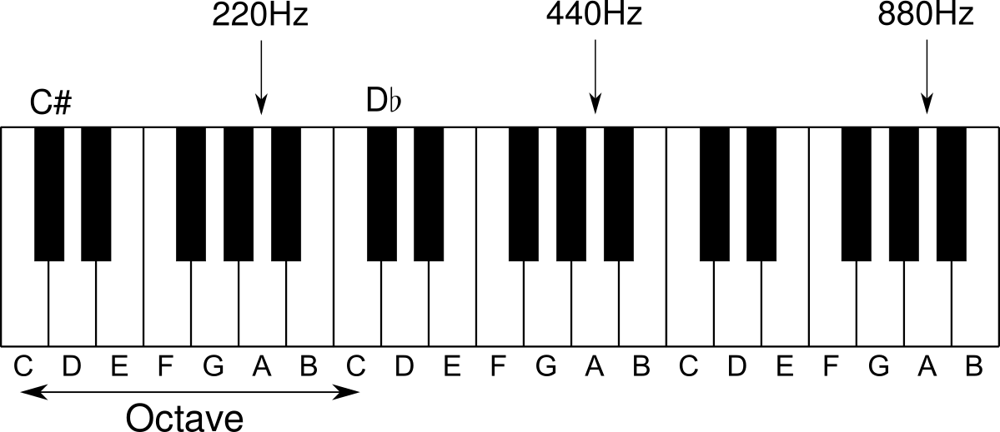
---
class: center, middle

<math>
  <mrow>
    <msup><mn>2</mn><mfrac><mrow><mi>n</mi><mo>-</mo><mn>69</mn></mrow><mn>12</mn></mfrac></msup><mo>*</mo><mn>440</mn><mu>Hz</mu>
  </mrow>
</math>

n = MIDI note (0-127)

0 = very low C

60 = middle C

69 = concert pitch A

---
class: center, middle
# A squarewave at 440 Hz

<audio src="samples/square.wav" data-player="fft-full"></audio>
---
class: center, middle
# Yes I know it sounds horrible
---
class: center, middle, subtitle
# Sculpting a sound
???
**00:08**
---
class: center, middle
# Subtractive Synthesis

---
class: center, middle
1. Start with high harmonic content
2. Filter down

---
class: center, middle

# Filter?!?

---
class: center, middle
# State Variable Filter


---

# State Variable Filter
```ruby
def run(input, frequency, q, type: :lowpass)
  # derived parameters
  q1 = 1.0 / q.to_f
  f1 = 2 * Math::PI * frequency / @sampling_frequency

  # calculate filters
  lowpass = @delay_2 + f1 * @delay_1
  highpass = input - lowpass - q1 * @delay_1
  bandpass = f1 * highpass + @delay_1
  notch = highpass + lowpass

  # store delays
  @delay_1 = bandpass
  @delay_2 = lowpass
  # [...]
end
```
---
class: center, middle
# Lowpass
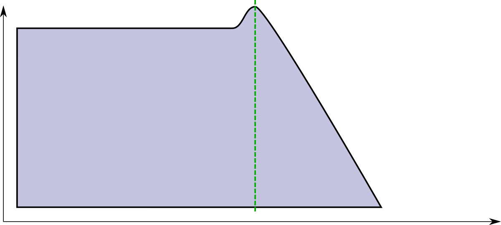
---
class: center, middle
# Lowpass (1000 Hz)
<audio src="samples/filtered.wav" data-player="fft-full"></audio>
---
class: center, middle
# Highpass
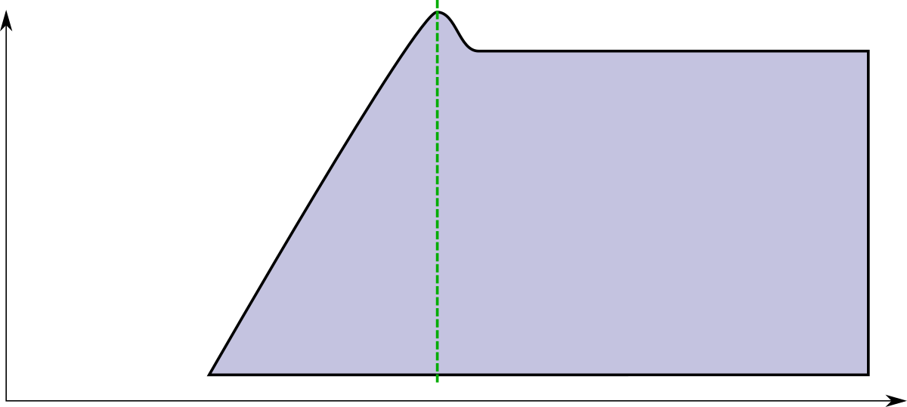
---
class: center, middle
# Highpass (2000 Hz)
<audio src="samples/highpass_filtered.wav" data-player="fft-full"></audio>
---
class: center, middle
# Bandpass

---
class: center, middle
# Bandpass (1200 Hz)
<audio src="samples/bandpass_filtered.wav" data-player="fft-full"></audio>
---
class: center, middle
# Band reject / Notch


---
class: center, middle
# Something's still wrong
---
class: center, middle
# Piano
<audio src="samples/piano_long.wav" data-player="fft-full"></audio>
---
class: center, middle
# Variance over time
---
class: center, middle
# Envelopes to the rescue
---
class: center, middle
# Not this

---
class: center, middle
# This!
<video src="images/adsr.ogv"></video>
---
class: small-code
```ruby
def linear(start, target, length, time)
  (target - start) / length * time + start
end

def run(t, released)
  if !released
    if t < 0.0001 # initialize start value (slightly hacky, but works)
      @start_value = @value
      return @start_value
    end
    if t <= a # attack
      return @value = linear(@start_value, 1, a, t)
    end
    if t > a && t < (a + d) # decay
      return @value = linear(1.0, s, d, t - a)
    end
    if t >= a + d # sustain
      return @value = s
    end
  else # release
    if t <= a # when released in attack phase
      attack_level = linear(@start_value, 1, a, releases)
      return linear(attack_level, 0, t - released)
    end
    if t > a && t < (a + d) # when released in decay phase
      decay_level = linear(1.0, s, d, released - a)
      return @value = linear(decay_level, 0, r, t - released)
    end
    if t >= a + d && t < released + r # normal release
      return @value = linear(s, 0, r, t - released)
    end
    if t >= released + r # after release
      return @value = 0.0
    end
  end
end

```
---
class: center, middle
# Shape everything!
---
class: center, middle
# Volume / Amplitude
``` ruby
# [...]
env = Adsr.new(0.001, 0.2, 0.5, 0.2)
t = i.to_f / SAMPLING_FREQUENCY.to_f
stopped = t >= 0.5 ? 0.5 : nil
output *= 0.3 * env.run(t, stopped)
```
---

class: center, middle
# Volume / Amplitude
<audio src="samples/amp_env.wav" data-player="scope-full"></audio>
---
class: center, middle
# Filter Frequency
``` ruby
# [...]
filter_env = Adsr.new(0.01, 0.1, 0.1, 0.1)
t = i.to_f / SAMPLING_FREQUENCY.to_f
stopped = t >= 0.5 ? 0.5 : nil
output = filter.run(output, 500.0 + (8000.0 * filter_env.run(t, stopped)), 1)
```
---
class: center, middle
# Filter Frequency
<audio src="samples/filter_env.wav" data-player="fft-full"></audio>
---
class: center, middle
# Pitch
``` ruby
# [...]
pitch_env = Adsr.new(0.01, 0.2, 0.0, 0.0)
t = i.to_f / SAMPLING_FREQUENCY.to_f
stopped = t >= 0.5 ? 0.5 : nil
period = SAMPLING_FREQUENCY / (FREQUENCY.to_f * ((0.2 * pitch_env.run(t, stopped)) + 1))
```
---
class: center, middle
# Pitch
<audio src="samples/pitch_env.wav" data-player="fft-full"></audio>

---
class: center, middle, subtitle
# Drums
???
**00:13**
---
class: center, middle, frame-image
# Kick drum

---
class: center, middle
# Kick drum synthesized
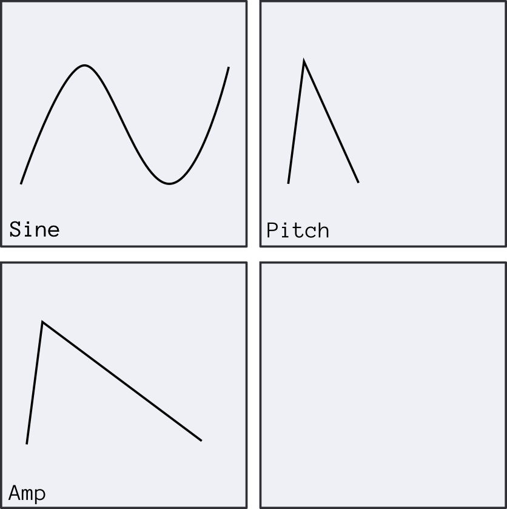
<audio src="samples/kick_drum.wav" data-player="scope-full"></audio>
---

class: center, middle, frame-image
# Snare drum

---
class: center, middle
# Snare drum synthesized
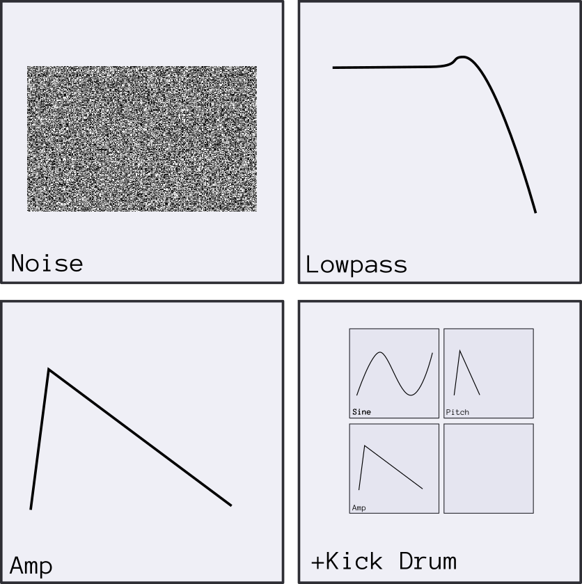
<audio src="samples/snare_drum.wav" data-player="scope-full"></audio>
---
class: center, middle, frame-image
# Hihat

---
class: center, middle
# Hihat synthesized
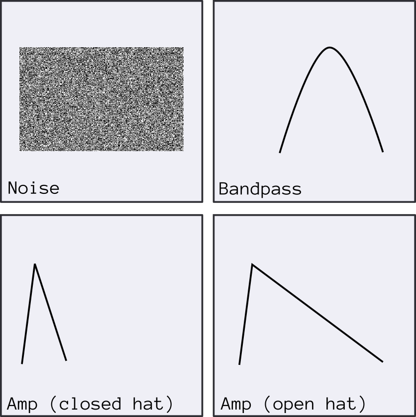
<audio src="samples/hihat.wav" data-player="scope-full"></audio>
---
class: center, middle
# Drum beats go like...
<audio src="samples/drums.wav" data-player="scope-full"></audio>
---

class: center, middle, subtitle
# Sound --> Music
---
class: center, middle
# Sequencing sounds
???
**00:18**
---
class: center, middle
# Beats, bars and s\*\*t
---
class: center, middle
# Measure of 4 / 4
---
class: center, middle
# 1, 2, 3, 4
## (4 beats in a bar)
## (beat == 1/4 note)
(yes, music counts from 1 - yes, that confuses me)
---
class: center, middle
# A bar
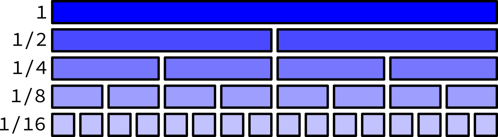
---
class: center, middle
# Step sequencer
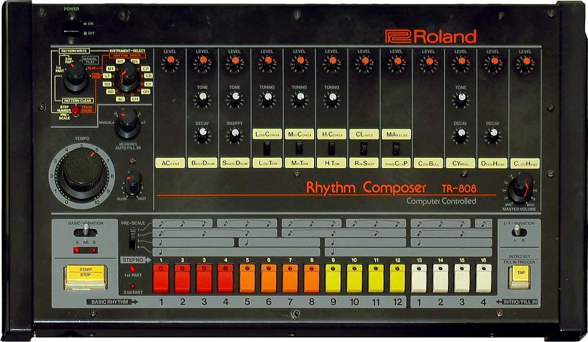
---
class: center, middle
# Tempo
## BPM (Beats per minute)
## (= Quarter notes per minute)
---
class: center, middle
# Sequencer maths
``` ruby
BPM = 120
beat_length_in_seconds = 60 / BPM # = 0.5s
bar_length = beat_length_in_seconds * 4 # = 2s
sixteenth_note_length = beat_length_in_seconds / 4 # = 0.125s

```
---
class: center, middle
# Notes > Patterns > Songs
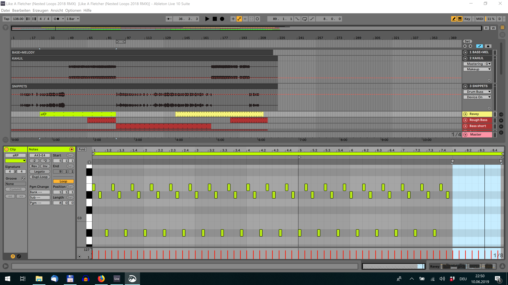
---
class: center, middle
# Notes > Patterns > Songs
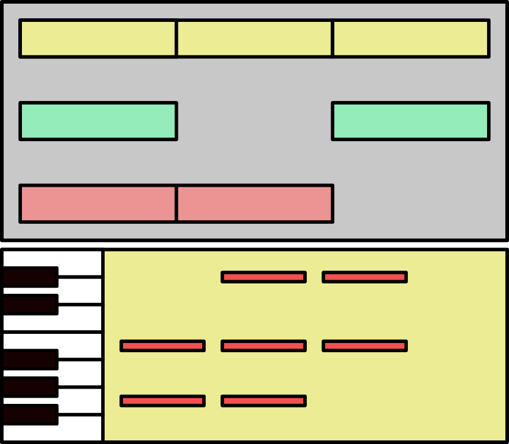
---
class: center, middle
# Let's build a DSL for that
---
class: center, middle
# Drums
``` ruby
def_pattern(:drums_full, 16) do
  drum_pattern kick_drum,   '*---*---*---*---'
  drum_pattern snare_drum,  '----*-------*---'
  drum_pattern hihat,       '--*---*---*---*-'
end
```
---
class: center, middle
# Notes
``` ruby
def_pattern(:bassline, 16) do
  note_pattern monosynth, [
    ['C1', 4], P, P, P,
    P, P, P, P,
    ['C#1', 6], P, P, P,
    P, P, P, P
  ]
end

```
---
class: center, middle
# A song

``` ruby
length = song(bpm: 115) do
  pattern(:drums_full, at: 0, repeat: 1)
  pattern(:drums_full, at: 2, repeat: 2)
  pattern(:bassline, at: 0, repeat: 4)
  pattern(:chord, at: 0, repeat: 4)
end
```
---
class: center, middle
# A song
<audio src="samples/simple_song.wav" data-player="scope-full"></audio>
---
class: center, middle, subtitle
# Mixing
???
**00:23**
---
class: center, middle
# Mixer / Mixing Desk / Console

---
class: center, middle

---
class: middle
# Channels
- Volume
- Equalizer
- Compressor
- Insert FX
---
class: center, middle
# Equalizer / EQ
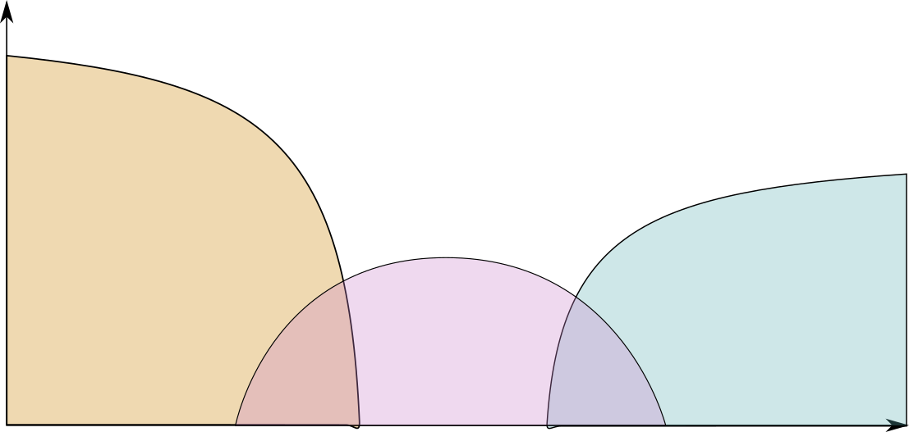
---
class: center, middle
# Compressor
<video src="images/compressor.ogv"></video>
---
class: center, middle
# Insert FX
---
class: center, middle
# Waveshaper
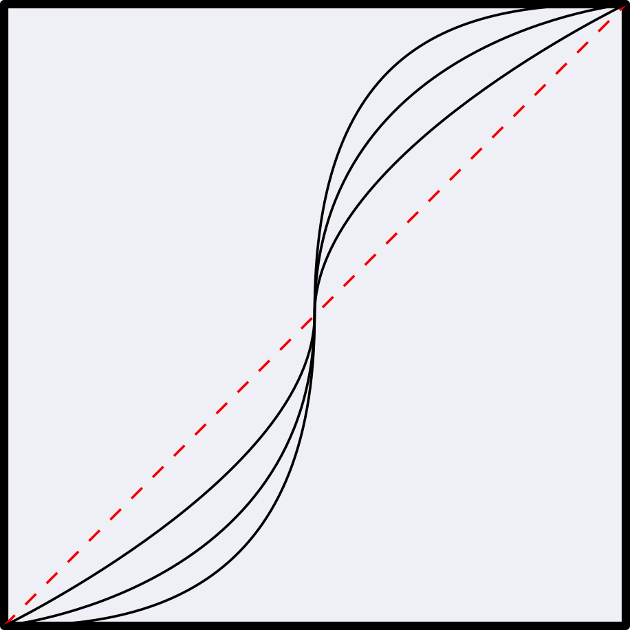
---
class: center, middle
# Waveshaper
``` ruby
def simple_waveshaper(input, a)
  input * (input.abs + a) / (input ** 2 + (a - 1) * input.abs + 1)
end
```
<audio src="samples/waveshaper.wav" data-player="scope-full"></audio>
---
class: center, middle
# Chorus
<video src="images/chorus.ogv?a"></video>
???
The overlay creates interferences
---
class: center, middle
# Chorus
<audio src="samples/chorus.wav" data-player="scope-full"></audio>
---
class: center, middle
# Send FX
---
class: center, middle
# Delay (Echo)
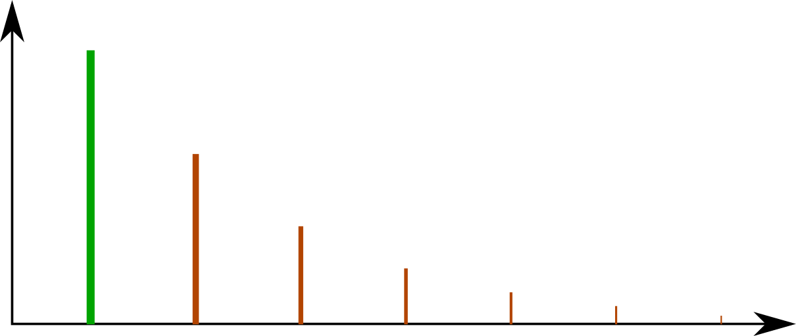
---
class: center, middle
# Delay (Echo)

``` ruby
def initialize(sample_rate, time)
  @buffer = Array.new((sample_rate.to_f * time).floor)
  @pointer = 0
end

def run(input, mix, feedback = 0.4)
  old_pointer = @pointer
  @pointer = (@pointer + 1) % @buffer.length
  delayed = (@buffer[@pointer] || 0.0)
  if block_given?
    delayed = yield delayed
  end
  @buffer[old_pointer] = input + (feedback * delayed)
  input * (1.0 - mix) + delayed * mix
end
```
---
class: center, middle
# Delay (Echo)

<audio src="samples/delay.wav" data-player="scope-full"></audio>
---
class: center, middle
# Reverb

---
class: center, middle
# Reverb
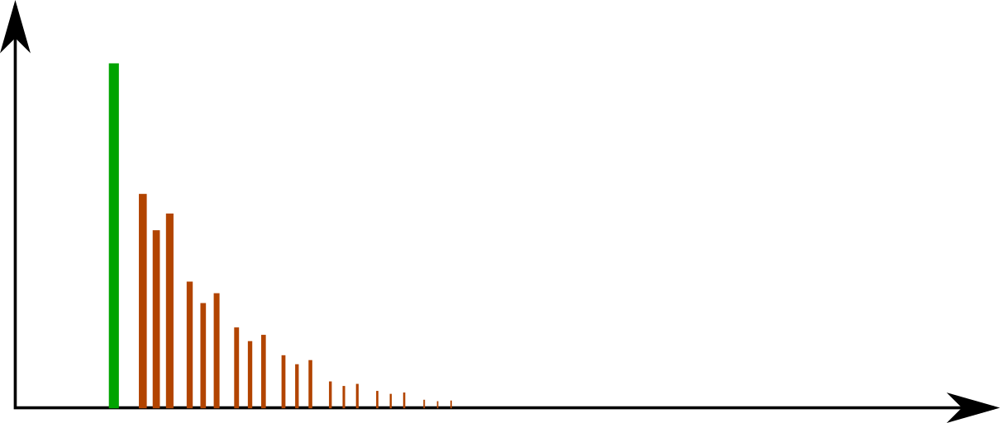
---
class: center, middle
# Reverb
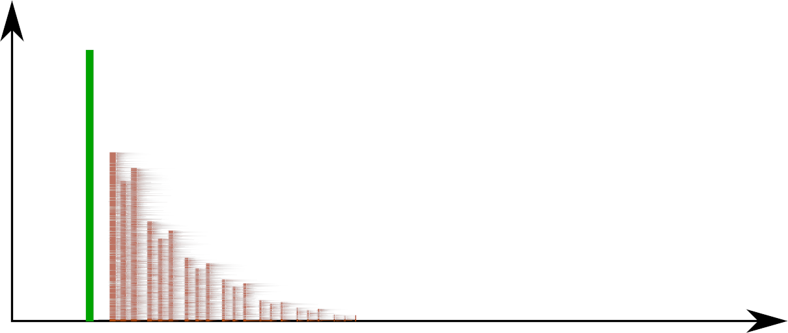

<audio src="samples/reverb.wav" data-player="scope-full"></audio>
---
# Sum
- Compressor
- Hard Limiter
---
class: center, middle
# Hard limiter
---
class: center, middle, subtitle
# Let's put it all together
<audio src="samples/full_song.ogg" data-player="scope-full">
???
**00:28**
---
class: subtitle, middle, center
# ❤️ Thank you ❤️
## http://rubysynth.fun

## 🎹 ✏️
## @halfbyte
## depfu.com


---
# Image Sources

(All taken from Wikimedia Commons)

- [DAC chip](https://commons.wikimedia.org/wiki/File:CirrusLogicCS4282-AB.jpg)
- [Loudspeaker](https://commons.wikimedia.org/wiki/File:Loudspeaker_side_en.svg)
- <a href="https://commons.wikimedia.org/wiki/File:Bass_drum_Premier_(8639408589).jpg">Kick drum</a>
- <a href="https://commons.wikimedia.org/wiki/File:Snare_drum_(line_art)_(PSF_S-860001_(cropped)).png">Snare drum</a>
- [Hihat](https://commons.wikimedia.org/wiki/File:Hi-hat.jpg)
- [Mixing Desk](https://commons.wikimedia.org/wiki/File:Image_of_a_mixing_desk_2014-02-16_00-50.jpg)
- <a href="https://commons.wikimedia.org/wiki/File:Roland_TR-808_(large).jpg">Roland 808</a>
- [Hallgrímskirkja](https://commons.wikimedia.org/wiki/File:Interior_of_Hallgr%C3%ADmskirkja_Church.jpg)
